# Crea tu propia aplicación de dibujo con Scratch

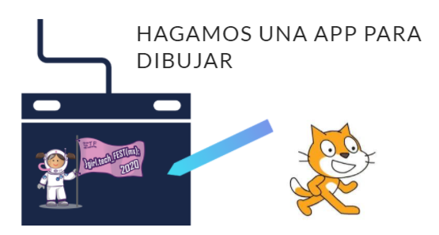

## Descripción del taller

Crearemos una aplicación con Scratch para generar tus propios dibujos.

El Lápiz es una herramienta muy poderosa en Scratch. En parte basada en su precursor, [LOGO](https://g.co/kgs/VzQyzc), las posibilidades más extensas de Scratch permiten elaborar mucho más que sólo pintar.

En este tutorial te vamos a enseñar cómo pintar y dibujar con el ratón en Scratch: cuando haces clic, que vaya dibujando sobre el escenario; cuando levantas el dedo del ratón, que deje de dibujar.

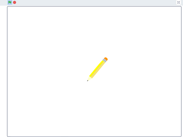

## Requisitos

- Computadora (preferentemente), tablet o smart phone.
- Conexión a internet.
- Conocer qué es Scratch (Deseable)

## ¡Comencemos!

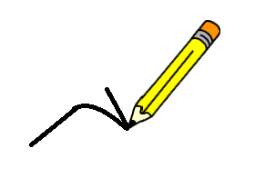

1.	Para iniciar, deberemos crear nuestro proyecto, para ello iremos a la [página de inicio de Scratch](https://scratch.mit.edu/)

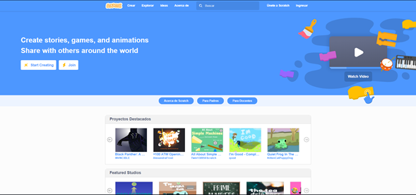

2.	Y daremos clic en el botón “Start creating” o “Empezar a crear”:

Inglés:
>-------
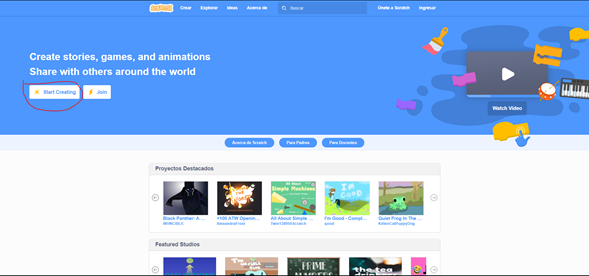

Español: 
>-------
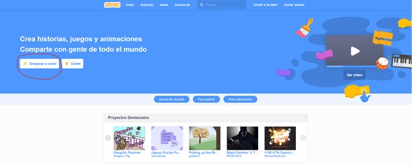

Ahí se abrirá nuestro espacio de trabajo. Donde también veremos diversas categorías de instrucciones para codificar.

Algo sencillo pero que nos puede dar muchas ideas para continuar programando, sobre todo para realizar proyectos artísticos y creativos.

### Cambiemos el idioma

Puede ser que tu espacio se vea en inglés, puedes cambiar el idioma dando clic en el globo:  y seleccionando de la lista “Español latinoamericano”.

Tu espacio de trabajo ahora se verá en español :wink:.

### Agreguemos la extensión "Lápiz"

3.	Agregaremos los controles de Lápiz. Para ello da clic en el ícono  (Agregar extensión), que se encuentra en la parte inferior izquierda de tu espacio de trabajo.

Se abrirá otra pantalla con la lista de extensiones disponibles, seleccionaremos la extensión llamada "Lápiz".

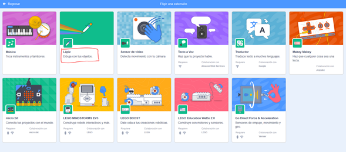

Verás que ahora en tu espacio de trabajo tienes los controles relacionados a Lápiz:

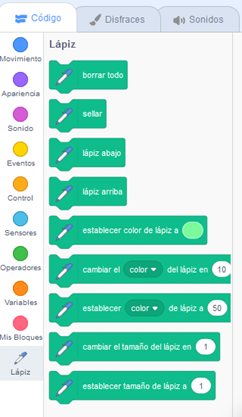

### Seleccionemos el objeto "Lápiz"

4.	Del lado derecho de nuestro espacio de trabajo veremos al famoso gato de Scratch. Vamos a cambiar al gato por un lápiz, que irá acorde a nuestra aplicación (un lápiz pinta, el gato no jeje).

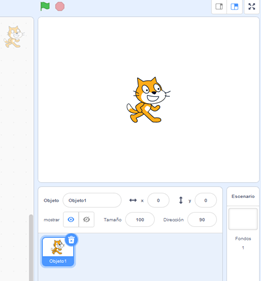

Damos clic en el bote de basura, que sale sobre el gato:

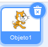

Ahora, daremos clic en el siguiente ícono para generar un nuevo objeto (que es el que se verá en nuestra aplicación, o sea un lápiz).

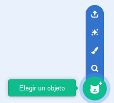

Aquí nos salen muchas opciones como puedes ver:

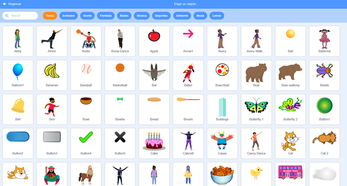

Buscaremos un lápiz, introducimos la palabra “pencil” en el campo “Buscar” (donde está la lupa, en el lado superior izquierdo de esta pantalla).

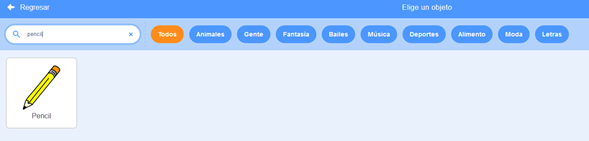

Damos clic en la imagen del lápiz y veremos que ahora, en lugar del gato, tenemos un lápiz en nuestro espacio de trabajo:

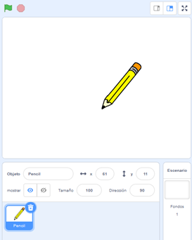

**Ahora sí estamos listos, ¡a programar nuestra aplicación de dibujo! :wink: :smile:.**

## Construyendo nuestro programa

5.	En la sección de controles (del lado izquierdo en nuestro espacio de trabajo) seleccionaremos la categoría Eventos (color amarillo). 

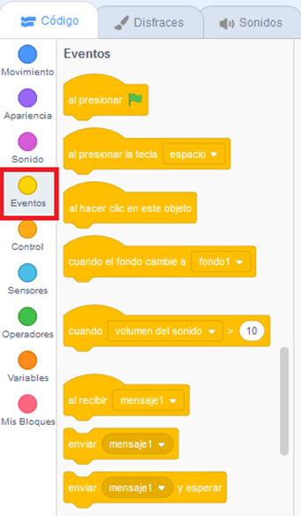

Y ahí arrastraremos al centro de nuestro espacio de trabajo el elemento “Al presionar” 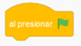

Por lo que nuestro espacio de trabajo ahora se ve así:

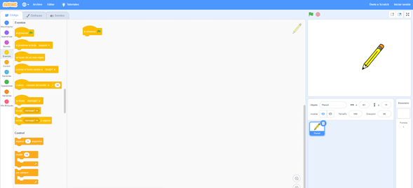

6.	Ahora, seleccionaremos la categoría Control, y así como hicimos con el elemento anterior, arrastraremos el elemento “Por siempre” a nuestro espacio de trabajo, debajo del elemento “al empezar” como si estuviéramos armando un rompecabezas:

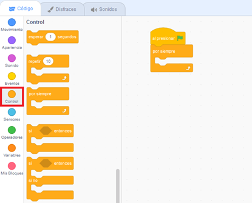

7.	Sigue los pasos anteriores, agregaremos ahora un par de elementos más para que tu espacio de trabajo quede así:

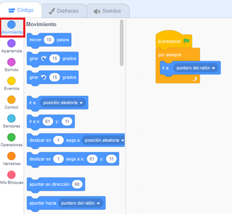

El elemento “ir a” tiene opciones, selecciona “puntero del ratón”.

Esto hará que el lápiz en la sección de prueba (esquina superior derecha) se mueva conforme se mueve el puntero del ratón. 

Para probarlo, da clic en la bandera verde 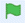.

Para detener la prueba y seguir programando, da clic en el octágono rojo 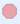.

8.	Ahora, como hiciste en los pasos anteriores, agrega los siguientes elementos a tu espacio de trabajo:

| Control | Categoría |  Imagen |
| --------- | --------- | --------- |
| al presionar | Categoría Eventos (amarilla) | 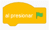|
| fijar tamaño a 50% | Categoría Apariencia (morada) | 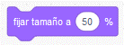|
| lápiz arriba | Categoría Lápiz | 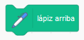|
| borrar todo | Categoría Lápiz | 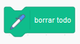|
| esperar 1 segundos | Categoría Control (naranja) | 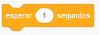|
| por siempre(^) | Categoría Control (naranja) | 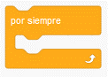|

>(^)Dentro del elemento “por siempre” agrega los siguientes elementos: 

| Control | Categoría |  Imagen |
| --------- | --------- | --------- |
| esperar hasta que(^^) | Categoría Control (naranja) | 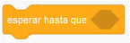|
| lápiz abajo | Categoría Lápiz | 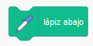|
| esperar hasta que(^^) | Categoría Control (naranja) | |
| lápiz arriba | Categoría Lápiz | |

>(^^) Para este elemento, agregarás en el espacio en blanco los siguientes elementos:

| Control | Categoría |  Imagen |
| --------- | --------- | --------- |
| ¿ratón presionado? | Categoría Sensores | 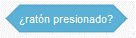|
| no(^^^) | Categoría Operadores (verde) | 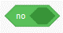|

>(^^^) Y dentro de este elemento agregarás: ¿ratón presionado? (Categoría Sensores) 

Ahora, tu espacio de trabajo quedará así:

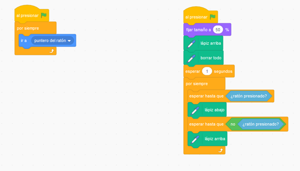

**¡Listo!** :sunglasses:

## Probemos nuestro programa

9.	Para probar nuestro programa, da clic en la bandera verde .

Verás que los bloques (elementos) tienen un contorno amarillo, esto significa que estás ejecutando tu programa. 

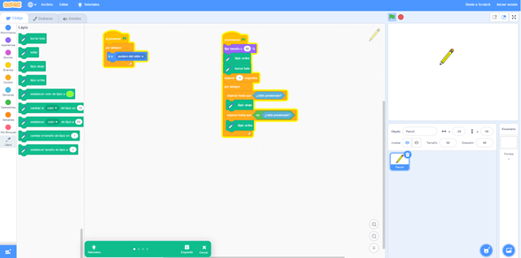

¡Ahora dibuja! 

10.	Coloca el ratón en la sección de tu espacio de trabajo donde está el lápiz, mueve el ratón y verás que se mueve el lápiz. 

Da clic y deja presionado el botón del ratón y ve que pasa. Suelta el botón del ratón. 

¿Has visto lo que tu programa hace?

También, puedes hacer esa sección de tu espacio de trabajo más grande para que veas tus trazos. 

11.	Da clic en el ícono  para hacer la sección más grande.

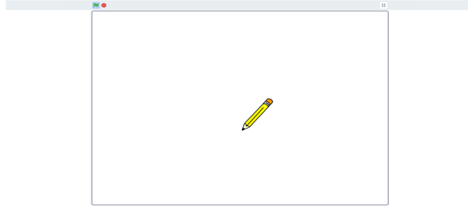

Da clic en el ícono  para regresar la sección a su tamaño original y regresar al espacio de trabajo.

12.	Para detener la prueba y seguir programando, da clic en el octágono rojo .

Y es así como queda nuestro código para nuestra aplicación que hemos creado para dibujar:

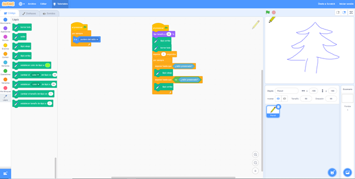

## Puedes agregar otras funcionalidades a tu aplicación

¿Qué tal quedaría tu app si agregamos efectos de sonido cuando el lápiz esté dibujando? o ¿qué tal si agregamos cambios de color a la línea que pinta tu lápiz?

¡Inténtalo!

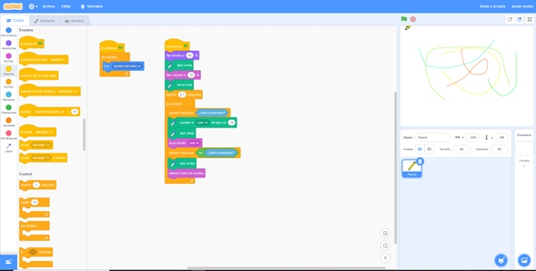

¡Agrega los elementos necesarios a tu programa y pruébalos!

Como puedes ver, puedes hacer muchas cosas programando :wink:

**Esperamos te hayas divertido.** :relaxed:

**¡GRACIAS!**

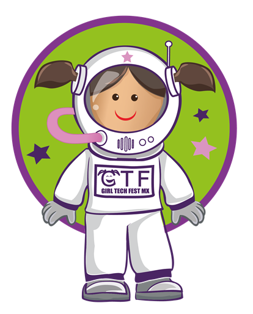

## Enlaces

Si aún quieres aprender más, visita la [página oficial de Scratch](https://scratch.mit.edu/) para ver más proyectos.

_Derechos reservados Giti Ameyalli [Girl Tech Fest MX](https://girltechfestmx.org/)_.