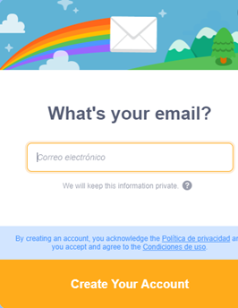

# Crea tu cuenta de Scratch

Si quieres hacer una cuenta en Scratch para guardar y compartir tus creaciones y así jugar con tus amigos sigue estos sencillos pasos:

a)	Ingresa un nombre de usuario y una contraseña que puedas recordar

b)	Selecciona el país en donde vives

c)	Ingresa tu fecha de nacimiento, sólo mes y año

d)	Ingresa tu género. Puedes seleccionar la opción “Prefer not to say” en caso de que prefieras no indicarlo

e)	Ingresa tu correo electrónico, si no tienes puedes pedirle a un adulto de confianza que te preste el suyo para registrarte

f)	¡Listo! Ahora podrás guardar tus creaciones como proyectos y compartirlo con quien quieras.

**¡LISTO!**

## Enlaces

Si quieres aprender más, visita la [página oficial de Scratch](https://scratch.mit.edu/) para ver más proyectos.

_Derechos reservados Giti Ameyalli [Girl Tech Fest MX](https://girltechfestmx.org/)_.